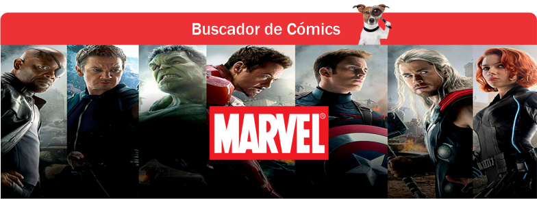
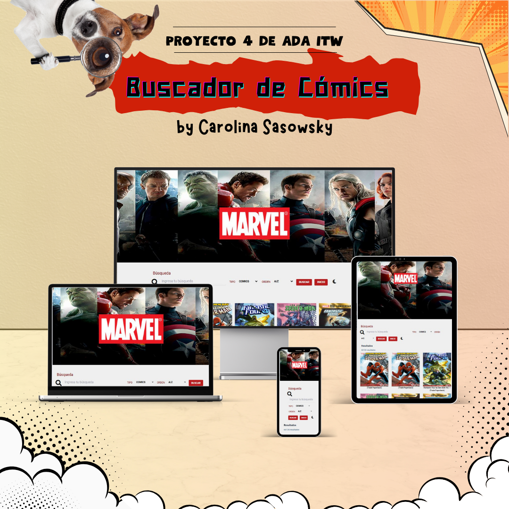

  

________________________________

# 
 María Carolina Sasowsky 

### 
 Desarrolladora Frontend | Mgter. en Diseño Editorial | Diseñadora Gráfica 

________________________________

## 🌟 Proyecto 4 - ADA ITW: Buscador de Cómics

Aplicación web que permite listar cómics y sus respectivos personajes, así como visualizar información detallada de cada uno. Fue desarrollada como trabajo final del **Módulo 4 de JavaScript** del programa **Desarrollo Frontend** de **ADA ITW**.

________________________________

## 🌐 Ver la aplicación en funcionamiento

👉 [Explorar la interfaz desplegada](https://tu-link.com)

________________________________

## 🖥️ Vista general del diseño

El sitio cuenta con un diseño responsivo, adaptado a distintos tamaños de pantalla para asegurar la navegación desde dispositivos móviles, tablets y desktop.

  

________________________________

## 🛠️ Tecnologías utilizadas

  

________________________________

## 🎨 Diseño y experiencia de usuario

La interfaz fue diseñada con foco en la experiencia del usuario, priorizando la accesibilidad, claridad visual y la interacción intuitiva. Se aplicaron principios de diseño editorial digital para estructurar jerarquías visuales claras.

________________________________

## 🔍 Funcionalidades principales

La aplicación permite explorar y obtener información detallada sobre cómics y personajes del universo Marvel, a través de una interfaz dinámica e intuitiva. Las funcionalidades incluyen:

- 🔎 **Búsquedas avanzadas**:
  - Búsqueda por nombre de cómic o personaje.
  - Filtros por título exacto y parámetros personalizados.
  - Ordenamiento alfabético y por fecha de lanzamiento (ascendente y descendente).

- 📄 **Visualización detallada de cómics**:
  - Portada, título, fecha de publicación.
  - Guionistas involucrados, sinopsis y personajes asociados.

- 👤 **Visualización detallada de personajes**:
  - Imagen, nombre, descripción y lista de cómics donde aparece.

- 📊 **Resultados informativos y dinámicos**:
  - Total de resultados visibles en cada búsqueda.
  - Paginado automático con 20 resultados por página.
  - Navegación a través de primera, última, anterior y siguiente página.
  - Botones de paginación deshabilitados cuando no están disponibles (por ejemplo, al estar en la primera o última página).

Estas funcionalidades garantizan una experiencia de usuario fluida, organizada y enriquecida visualmente.

________________________________

## 🧩 Funcionalidades secundarias

Además de las funciones principales, se incorporaron mejoras que optimizan la experiencia de uso:

- Se agregó la visualización de la **cantidad total de páginas** y de la **página actual** dentro del sistema de paginación.
- Se integró un **selector de páginas**, permitiendo acceder directamente a cualquier página de resultados.
- Se añadió un botón de **retorno a la búsqueda anterior**, que conserva los filtros aplicados y la posición en la lista tras consultar el detalle de un cómic o personaje.
- Se implementó un **modo oscuro**, ofreciendo una alternativa visual que mejora la accesibilidad y reduce la fatiga visual.

________________________________

## 📂 Objetivo del proyecto

Este proyecto forma parte de mi **Portafolio Personal**, con el objetivo de mostrar el nivel de desarrollo técnico y creativo alcanzado durante el proceso de formación.

---
